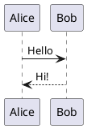

# Installation

## Prerequisites

Before installing the plugin, make sure you have:

- **Python 3.10+**
- **MkDocs 1.5+** (`pip install mkdocs`)
- **Claude CLI** installed and authenticated

### Install the Claude CLI

The plugin uses the `claude` CLI under the hood. Install it from [claude.ai/code](https://claude.ai/code) and authenticate:

```bash
claude login
claude --version   # confirm it works
```

## Install the plugin

```bash
pip install mkdocs-claude-chat
```

Or with `uv`:

```bash
uv add mkdocs-claude-chat
```

## Add to mkdocs.yml

```yaml
plugins:
  - search
  - claude-chat
```

That's the minimum configuration. See [Configuration](../configuration.md) for all available options.

## Optional plugins

These plugins are not required but work well alongside `mkdocs-claude-chat`.

### mkdocs-llmstxt

Generates an `/llms.txt` index file so Claude can discover and fetch only the relevant doc sections instead of searching the web.

```bash
pip install mkdocs-llmstxt
```

```yaml
plugins:
  - search
  - llmstxt:
      full_output: llms-full.txt   # also generate a single-file version
      sections:
        Getting Started:
          - index.md
          - getting-started/installation.md
        Reference:
          - reference/api.md
  - claude-chat
```

Claude automatically discovers `/llms.txt` from `site_url` — no extra config needed. The `full_output` option also generates `/llms-full.txt` with the complete content of all listed pages concatenated into one file.

---

### mkdocs-material

The Material theme is the most popular MkDocs theme and works seamlessly with the chat widget.

```bash
pip install mkdocs-material
```

```yaml
theme:
  name: material
  features:
    - navigation.tabs
    - navigation.sections
    - content.code.copy
```

---

### mkdocs-kroki-plugin

Renders diagrams from PlantUML, GraphViz, BlockDiag, BPMN, Excalidraw and more via the [Kroki.io](https://kroki.io) service — no local installation needed.

```bash
pip install mkdocs-kroki-plugin
```

```yaml
plugins:
  - kroki:
      server_url: https://kroki.io
      enable_mermaid: false   # if using Material's native Mermaid
```

Use in Markdown:

````markdown

````

---

### mkdocstrings

Auto-generates API reference pages from Python docstrings.

```bash
pip install mkdocstrings[python]
```

```yaml
plugins:
  - mkdocstrings:
      handlers:
        python:
          paths: [src]
```

---

### Full example with all optional plugins

```yaml
plugins:
  - search
  - llmstxt:
      full_output: llms-full.txt
      sections:
        Docs:
          - "**"
  - kroki:
      server_url: https://kroki.io
  - mkdocstrings:
      handlers:
        python:
          paths: [src]
  - claude-chat:
      model: claude-sonnet-4-6
```

## Verify

```bash
mkdocs serve
```

You should see in the terminal:

```
INFO    -  claude-chat: starting chat backend on http://localhost:8001
INFO    -  Building documentation...
INFO    -  Serving on http://127.0.0.1:8000/
```

Open your browser — a chat button appears at the bottom-right corner.
